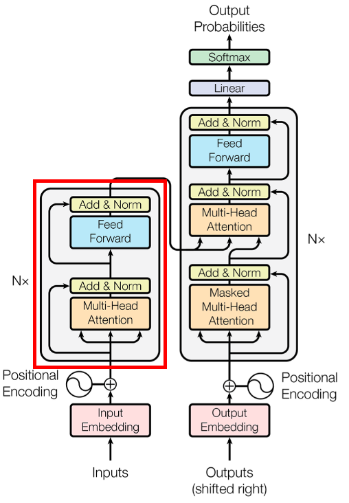
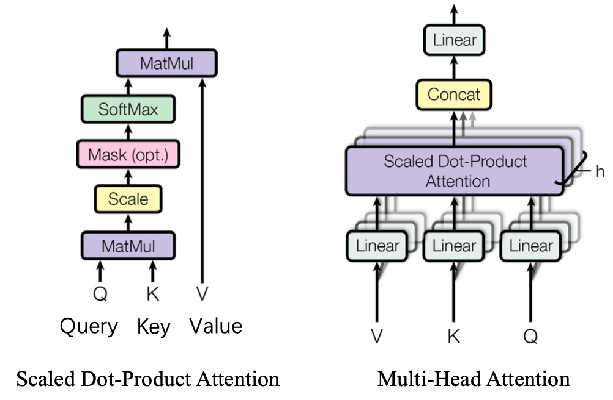
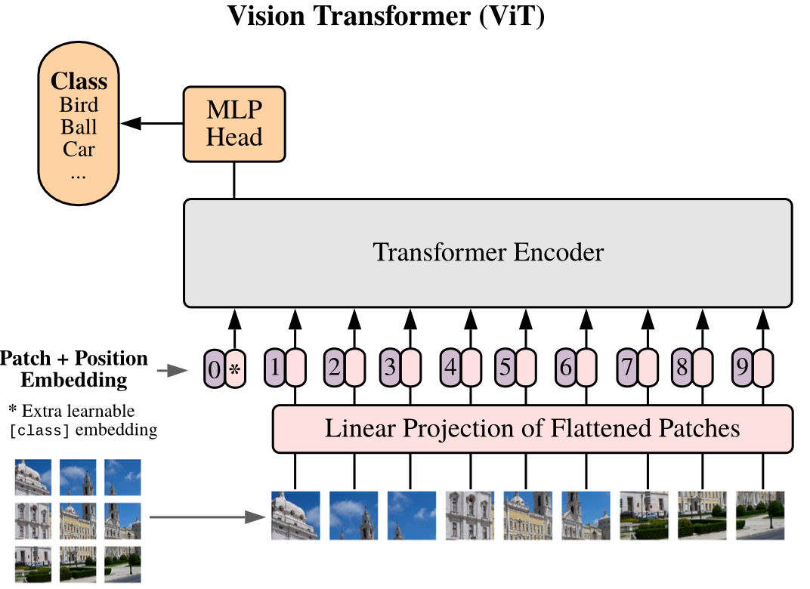

# ViT

ViT是Transformer在图像上的应用，这里是对MNIST数据集做分类任务，因此只需要Encoder即可，不需要Decoder的生成部分。

----

### 数据集

这里记录的是公开数据集 MNIST。

MNIST数据集是一个大型手写数字数据库，包含60000张训练图像和10000张测试图像，通常用于训练各种图像处理系统。所有的手写数字图片的分辨率为**28*28**。

MNIST官方地址为：http://yann.lecun.com/exdb/mnist/

|     数据集     |         MNIST文件          |                          下载地址                           |  文件大小   |
| :------------: | :------------------------: | :---------------------------------------------------------: | :---------: |
| Training image | train-images-idx3-ubyte.gz | http://yann.lecun.com/exdb/mnist/train-images-idx3-ubyte.gz | 9912422字节 |
| Training label | train-labels-idx1-ubyte.gz | http://yann.lecun.com/exdb/mnist/train-labels-idx1-ubyte.gz |  28881字节  |
| Testing image  | t10k-images-idx3-ubyte.gz  | http://yann.lecun.com/exdb/mnist/t10k-images-idx3-ubyte.gz  | 1648877字节 |
| Testing label  | t10k-labels-idx1-ubyte.gz  | http://yann.lecun.com/exdb/mnist/t10k-labels-idx1-ubyte.gz  |  4542字节   |

不过并不建议使用url下载或去官方地址下载，懂得都懂...

数据集加载：

```python
def load_mnist(batch_size_train, batch_size_test=1):
    transform_mnist = torchvision.transforms.Compose([torchvision.transforms.ToTensor(),
                                                torchvision.transforms.Normalize((0.1307,), (0.3081,))])
    train_set = torchvision.datasets.MNIST(root='./dataset', train=True, download=True, transform=transform_mnist)
    train_loader = torch.utils.data.DataLoader(train_set, batch_size=batch_size_train, shuffle=True)
    test_set = torchvision.datasets.MNIST(root='./dataset', train=False, download=True, transform=transform_mnist)
    test_loader = torch.utils.data.DataLoader(test_set, batch_size=batch_size_test, shuffle=False)
    
    print('MNIST dataset load successful')
    print('-' * 80)
    print(f'Total train image-label pair: {len(train_loader.dataset)}')
    print(f'Total test  image-label pair: {len(test_loader.dataset)}')
    print('-' * 80)

    return train_loader, test_loader
  
''' output:
MNIST dataset load successful
-------------------------------------------------------
Total train image-label pair: 60000
Total test  image-label pair: 10000
-------------------------------------------------------
'''
```

---

### Encoder



Encoder直接参照红框内的结构进行搭建，总共可以分为两个大部分----MHA和FFN，其中MHA分为多头注意力和残差连接，FFN分为前馈网络和残差连接。

为了能够达到搭积木的效果，我们先将模型进行模块化，把模块单独成类

##### 残差连接Add

```python
class Residual(nn.Module):
    def __init__(self, module):
        super().__init__()
        self.module = module

    def forward(self, x, **kwargs):
        return self.module(x, **kwargs) + x
```

这里对应的图中的Add，就是残差连接。这里**kwargs为参数列表，由于Add作用于不同模块之后，为了适应不同的模块，这里直接用参数列表的方式将参数直接传入模块中。一般放在FFN和MHA之后。

Add的作用是为了加速训练，防止梯度消失，与ResNet一致。

##### 层归一化Norm

```python
class PreNorm(nn.Module):
    def __init__(self, dim, module):
        super().__init__()
        self.norm = nn.LayerNorm(dim)
        self.module = module

    def forward(self, x, **kwargs):
        return self.module(self.norm(x), **kwargs)
```

这里对应图中的Norm，就是层归一化。参数列表同Add。一般放在MHA和激活函数。

Norm的作用是为了加速训练。

##### 前馈网络FeedForward

```python
class FeedForward(nn.Module):
    def __init__(self, dim, hidden_dim):
        super().__init__()
        self.FFnet = nn.Sequential(
            nn.Linear(dim, hidden_dim),
            nn.GELU(),
            nn.Linear(hidden_dim, dim),
        )

    def forward(self, x):
        return self.FFnet(x)
```

 这里对应图中的FeedForward，就是前馈网络。参数列表为输入输出的维度。内部为两个全连接层，第一个全连接层后面接一个激活函数。

FeedForward的作用在Transformer中是至关重要的，别看它结构非常简单仅两层全连接层。FF起到的作用是学习信息的作用。Transformer中除了Attention就是FF了，然而Attention是全线性的，如果没有FF就会导致Transformer不存在非线性变换。众所周知，深度学习能崛起的关键就是通过非线性变换来拟合复杂曲线。FF能够提供非线性变换。

##### 多头注意力Multi-Head Attention



```python
class Attention(nn.Module):
    def __init__(self, dim, heads = 8):
        super().__init__()
        
        self.heads = heads	# attention个数
        self.scale = heads ** -0.5	# Scale

        self.to_qkv = nn.Linear(dim, dim * 3, bias = False) # 处理QKV的linear
        self.to_out = nn.Linear(dim, dim)	# 最后的linear
    
    def forward(self, x, mask=None):
        b, n, _, h = *x.shape, self.heads   # [B, 17, 64], 8
        qkv = self.to_qkv(x)    # [B, 17, 64*3]，qkv统一处理，维度为[b, n 3*h*d]
        q, k, v = rearrange(
          qkv, 
          'b n (qkv h d) -> qkv b h n d', 
          qkv=3, h=h)    # [B, 8, 17, 8]， 根据head进行划分，[b, h, n, d]
        
        dots = torch.matmul(q, k.transpose(-1, -2)) * self.scale # [B,8,17,17], QK^T

        if mask is not None:	# Decoder中的mask attention
            mask = F.pad(mask.flatten(1), (1, 0), value=True)
            assert mask.shape[-1] == dots.shape[-1], f'{mask.shape[1]} != {dots.shape[1]}'
            mask = mask[:, None, :] * mask[:, :, None]
            dots = dots.masked_fill(~mask, float("-inf"))
            del mask
        
        attn = dots.softmax(dim=-1)	# Softmax

        out = torch.matmul(attn, v) # [B, 8, 17, 8]，QK^T * V，得到与QKV维度一致的out
        out = rearrange(out, 'b h n d -> b n (h d)') # [B, 17, 64]，与concat作用类似，
        out = self.to_out(out)  # [B, 17, 64]，linear
        return out
```

这里对应图中的Multi-Head Attention，就是多头注意力。参数列表为输入/出维度和Attention个数。MHA的核心在于QK^T。因此前后处理可自由选择，这里使用矩阵重组的方式来处理。QKV使用一个linear来统一处理，通道数为3*dim，可以看作是QKV被concat在一起。然后使用rearrange做划分，生成QKV，单个维度为[HND]。attention score通过矩阵乘的形式计算。最后乘上V再通过rearrange矩阵重组来代替 concat(out, dim=1)。因为linear是对矩阵最后一个维度进行全连接运算，因此不管是多头head还是QKV都可以放在一个矩阵里处理。

Self-Attention的作用是通过计算n个全特征之间的相关性来关联全局信息，使得单个信息得到与所有信息的重要性程度。注意力，顾名思义就是模型应该关注的地方。Attention Score越高说明该信息在整体中越重要。MHA的本质是在参数总量不变的情况下，将同样的QKV映射到不同的子空间中进行注意力计算。有点类似于CNN中的多个卷积核的作用，每个Head关注不用的信息。找到一下这个例子能够比较好的说明，每种颜色代表一个Head，通过关注多种信息可以更准确的判断正确的答案。


##### Transformer Block

```python
class transformer_base(nn.Module):
    def __init__(self, dim, depth, heads, mlp_dim):
        super().__init__()
        self.layers = nn.ModuleList([])
        for _ in range(depth):
            self.layers.append(nn.ModuleList([
                Residual(PreNorm(dim, Attention(dim, heads=heads))), # MHA + Add&Norm
                Residual(PreNorm(dim, FeedForward(dim, mlp_dim)))	# FFN + Add&Norm
            ]))

    def forward(self, x, mask=None):
        print(x.shape)
        for attn, ff in self.layers:
            x = attn(x, mask=mask)
            x = ff(x)
        return x
```

这里对应图中的红框，就是Transformer block。参数列表为输入/出维度、block的个数，Head，FFN的输出维度。内部为整合各个模块组成一个Transformer block。

##### ViT



```python
class ViT(nn.Module):
    def __init__(
        self,
        *,
        image_size,
        patch_size,
        num_classes,
        dim,
        depth,
        heads,
        mlp_dim,
        channels=3
    ):
        super().__init__()
        assert (
            image_size % patch_size == 0
        ), "Image dimensions must be divisible by the patch size."
        num_patches = (image_size // patch_size) ** 2
        patch_dim = channels * patch_size**2	# [p**2, c], patch展平后的长度

        self.patch_size = patch_size

        # 这里位置Embedding可以直接使用随机数，因为图像输入之间本身是具备顺序关系，并且这里也仅为分类任务，对位置信息不敏感
        self.pos_embedding = nn.Parameter(torch.randn(1, num_patches + 1, dim))
        self.patch_to_embedding = nn.Linear(patch_dim, dim)
        self.cls_token = nn.Parameter(torch.randn(1, 1, dim))
        self.transformer = transformer_base(dim, depth, heads, mlp_dim)

        self.to_cls_token = nn.Identity()	# 这是一个恒等映射，为了标记输出用的，无参数
        self.mlp_head = nn.Sequential(
            nn.Linear(dim, mlp_dim), nn.GELU(), nn.Linear(mlp_dim, num_classes)
        )

    def forward(self, x, mask=None):
        p = self.patch_size

        x = rearrange(
            x, "b c (h p1) (w p2) -> b (h w) (p1 p2 c)", p1=p, p2=p
        )  # [B C H W] -> [B N PPC] ====> [B, 1, 28, 28] -> [B, 16, 49]
        # 将图像进行切块，并形成一维序列化Embedding用于输入Transformer，
        #也可用view(x.shape[0], x.shape[1], -1, p, p)->x.transpose(1, 2)->reshape(x.shape[0], -1, p * p)代替
        x = self.patch_to_embedding(x)  # [B N PPC] -> [B N PPC D] ====> [B, 16, 49] -> [B, 16, 64]
        cls_tokens = self.cls_token.expand(x.shape[0], -1, -1)  # [N 1 D]
        x = torch.cat((cls_tokens, x), dim=1)  # [N PPC+1 D], 添加用于分类的Embedding
        x = x + self.pos_embedding	# 加上位置Embedding
        x = self.transformer(x, mask)	# Transformer block
        x = self.to_cls_token(x[:, 0])	# 提取分类Embedding
        x = self.mlp_head(x)	# 多层感知机
        return x
```

这里就是ViT了，