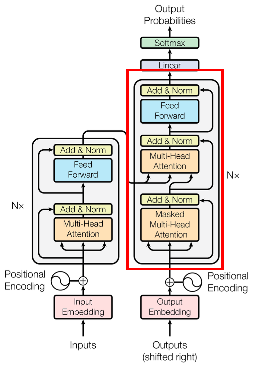
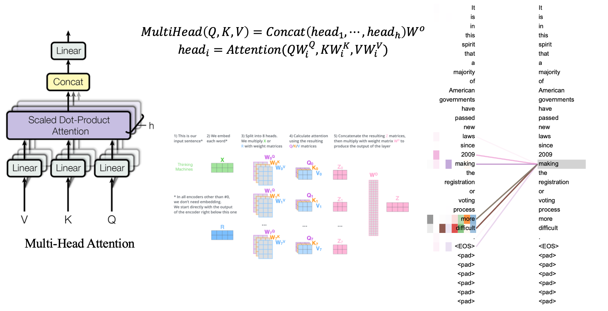

# The theory of transformer

Transformer可以说是一个完全基于自注意力机制的深度学习模型，并且由于其适用并行化计算，和它本身的易拓展性导致它在精度和性能上都能取得非常显著的优势。

在这里，我会把模型写的全一些，尽量简化，力争让你可以轻易理解。

### Transformer整体架构

首先介绍Transformer的整体结构，下图是一个法英文翻译的例子：

对于Transformer的整体结构，可以看作是由左图编码器和右图解码器两部分组成。

Transformer的整体工作流程大体如下：

第一步：获取输入句子的每一个单词的表示向量X，X由句子的Embedding和单词位置的Embedding相加得到。

第二步：将得到的单词表示向量矩阵传入Encoder中，经过n个Encoder block后可以的到句子所有单词的编码信息矩阵C。单词向量矩阵用Xn*d表示，n是句子中单词的个数，d表示向量的维度。每一个Encoder block输出的矩阵维度与输入相同。

第三步：将Encoder输出的编码矩阵C传递到Decoder中，Decoder依次会根据当前翻译过的单词1~i翻译下一个单词i+1。在使用过程中，翻译到的单词i+1的时候会根据Mask操作进行前后顺序的遮盖，就是让Decoder无法看到第i+1个单词后面的单词。

Decoder的解码过程可以这样描述，Decoder接受到Encoder的编码矩阵C后，首先输入一个翻译开始字符""，然后预测第一个单词"I"；接着输入开始字符""和单词"I"，预测单词"am"，一次循环直到翻译结束。

以上是Transformer使用的大致流程，接下来对里面各个部分进行介绍

### Transformer的输入

Transformer中单词的输入表示 X 由单词Enbedding和位置Enbedding相加得到。

##### 单词Embedding

单词的Embedding有很多种方式获得，例如Word2Vec、Glove等算法预训练得到，也可以在Transformer中训练获得。

##### 位置Embedding

Transformer中是需要使用位置Embedding来表示各个输入之间位置关系的。因为Transformer没有沿用RNN的循环结构，而是一次性全局信息，因此并不能利用输入之间的顺序信息，这部分在NLP中是非常重要的，然而在图像等其他自带关系的任务中并不是那么重要，但也有一定的作用。

Transformer中使用位置Embedding来保存输入在序列中的相对或绝对位置关系。位置Embedding用PE表示，PE的维度与单词Embedding是一样的。PE可以通过训练得到，也可以使用某种公式计算得到。在Transformer中采用了后者，计算公式如下：
$$
PE_{(pos, 2i)} = sin(pos/10000^{2i/d})
$$

$$
PE_{(pos, 2i+1)} = cos(pos/10000^{2i/d})
$$

其中，pos表示单词在句子中的位置，d表示PE的维度，2i/2i+1表示偶/奇数。

使用PE作为位置编码的好处在于，能够使模型适应更多更长的句子。可以假想，在训练集中最长的句子是20个单词，然而在推理的时候突然出现一个长度超过或远超20的句子，那么通过PE也可以轻松的进行位置编码。在一个好处是PE编码使用了三角函数，通过三角函数的转换公式，可以让模型轻易的计算出单词之间的相对位置，有利与句子的语境翻译。
$$
𝑃𝐸_{(M+𝑁,2𝑖)}=𝑃𝐸_{(𝑀,2𝑖)}  × 𝑃𝐸_{(𝑁,2𝑖+1)}  + 𝑃𝐸_{(𝑀,2𝑖+1)}  × 𝑃𝐸_{(𝑁,2𝑖)}
$$

$$
𝑃𝐸_{(M+𝑁,2𝑖+1)}=𝑃𝐸_{(𝑀,2𝑖+1)}  × 𝑃𝐸_{(𝑁,2𝑖+1)}  - 𝑃𝐸_{(𝑀,2𝑖)}  × 𝑃𝐸_{(𝑁,2𝑖)}
$$

形式上来看是不是跟三角函数的和角公式一模一样？

将单词Embedding和位置Embedding相加，就可以得到单词的表示向量X，即Transformer的输入

### Self-Attention 自注意力机制

上图是论文中Transformer的内部结构图，左侧是Encoder block，右侧是Decoder block。红圈圈住的部分为多头注意力(Multi-Head Attention, MHA)，由多个自注意力组成。可以看到整个transformer结构中，除了MHA就是残差连接Add、归一化Norm、和前馈网络FFN，这些都是非常常用的神经网络层。

因此自注意力的Transformer的重点。首先详细了解一下self-attention的内部逻辑

##### Self-Attention结构

在计算的时候需要用到矩阵Q(查询)、K(键)、V(值)。在实际中，Self-Attention接受的是输入或者上一个Encoder block的输出。而QKV是通过Self-Attention的输入进行线性变换得到的。

##### Q、K、V的计算

Self-Attention的输入用矩阵X进行表示，使用线性变换矩阵W计算的到QKV。

##### Self-Attention的输出

得到QKV之后就可以计算出Self-Attention的输出了，计算公式如下：
$$
Attention(Q,K,V) = (𝑠𝑜𝑓𝑡𝑚𝑎𝑥((𝑄𝐾^𝑇)/√(𝑑_𝑘))V
$$
式中计算矩阵Q和K的每一行向量的内积，防止内积过大，因此除以dk的根。得到的QK矩阵的行列数都是n，n为输入的个数，这个矩阵可以表示输入之间的attention强度，即关联性。下图为Q乘以K^T

得到QK^T之后，使用softmax计算每一个单词对于其他所有单词的attention系数，公式中的softmax是对矩阵的每一行进行softmax，即每一行的和为1。

得到Softmax矩阵之后可以和V相乘，得到最后的输出Z。

上图的Softmax矩阵的第一行表示单词1与其他所有单词的attention系数，最终单词1的输出Z1等于与所有单词i的值Vi根据Attention系数的比例加在一起，如下图所示：

### Multi-Head Attention

现在我们已经得到了输出矩阵Z，而Multi-Head Attention是由多个Self-Attention组成的

从图中可以看到Multi-Head Attention包含多个Self-Attention，首先将输入X分别传递给h个不同的Self-Attention中，计算得到h个输出矩阵Z。

得到h个输出矩阵后，Multi-Head Attention将它们拼接(Concat)在一起，然后传入一个全连接层，得到最终输出OutputZ。
$$
Output_Z=Linear(Concar(Z_1,Z_2,...,Z_h))
$$
式中，OutputZ的维度与输入X的维度是相同的。

##### Encoder结构

上图红色部分是Transformer的Encoder block结构，由Multi-Head Attention、Add&Norm、FFN组成。

##### Add&Norm

Add&Norm由Add和Norm两部分组成，公式如下：
$$
LayerNorm(X+MultiHeadAttention(X))
$$

$$
LayerNorm(X+FeedForward(X))
$$

式中，X表示MHA和FFN的输入。Add指式中的加法，是一种残差连接，最早由何凯明在ResNet中提出，通常用于解决深层网络训练问题，可以让模型只关注到当前差异的部分。

下侧为ResNet论文中的图。

Norm指Layer Normalization层归一化，通常用于RNN结构中，会将每一层神经元的输入都转成均值方差都一样的，这样可以加速收敛。

##### Feed Forward

FFN层比较简单，是一个两层的全连接层，第一层的激活函数为Relu，第二层不用激活函数，对应公式如下：
$$
max(0, XW_1+b_1)W_2+b_2
$$
式中，X为输入，FFN的输出矩阵与X一致。

##### 组成Encoder

通过上述的各个组件就可以构造出一个Encoder block来，Encoder block接收输入矩阵X，并输出一个矩阵O。通过多个block堆叠就可以形成Encoder。

### Decoder结构

上图红色部分为Transformer的Decoder block结构，与Encoder block相似，但是存在一些区别：

- 包含两个Multi-Head Attention层
- 第一个Multi-Head Attention层采用了Masked操作
- 第二个Multi-Head Attention层的K、V矩阵来自Encoder的编码矩阵C进行计算，而Q使用上一个Decoder的输出
- 最后一个Softmax层计算下一个翻译单词的概率

##### 第一个Multi-Head Attention

Decoder block的第一个Multi-Head Attention采用了Masked操作，因为在翻译的过程中是顺序翻译的，即翻译完第i个单词，才可以翻译第i+1个单词。通过Masked操作可以防止第i个单词知道第i+1个单词之后的信息。

上面以"我是一名学生"翻译成"I am a student"为例，了解一下Masked操作。其中使用了类似Teacher Forcing操作。在Decoder的时候，是需要根据之前的翻译，求解当前最有可能的翻译。首先根据输入""预测出第一个单词为"I"，然后根据输入"I"预测下一个单词"am"。

Decoder可以在训练的过程中使用Teacher Forcing并且并行化训练，即将正确的单词序列()传递到Decoder。那么在预测第i个输出时，就要将第i+1之后的单词掩盖住，注意mask操作实在Self-Attention的Softmax之前使用的。下面以图文形式进行演示：

第一步：是Decoder的输入矩阵和Mask矩阵，输入矩阵包含"I am a student"四个单词的表示向量，Mask是一个4*4的三角阵。在Mask可以发现单词0只能使用单词0的信息，而单词1可以使用单词0、1的信息，即只能使用之前的信息。

第二步：接下来的操作与Self-Attention一样，通过输入矩阵X计算得到QKV矩阵，然后计算QK^T。

第三步：在得到QK^T之后需要进行Softmax，计算Attention score，在计算之前需要使用mask矩阵遮挡住后面的信息。

得到Mask QK^T之后进行softmax，每一行的和为1。但后面被掩盖的单词的attention score都为0。

第四步：使用Mask QK^T与矩阵V相乘，得到输出Z。

第五步：通过上述步骤就可以得到一个Mask Self-Attention的输出矩阵Zi，然后与Encoder类似。Z与输入X的维度一致。

##### 第二个Multi-Head Attention

Decoder block第二个Multi-Head Attention变化不大，主要区别在于其中Self-Attetion的K、V来自Encoder的编码矩阵C。

根据Encoder的输出C计算得到K、V，根据上一个Decoder block的输出Z计算Q，后续的计算方法与之前描述一致。

这样做的好处实在Decoder的时候，每一位单词都可以利用到Encoder所有单词的信息。

##### Softmax预测输出单词

Decoder block最后的部分是利用Softmax预测下一个单词，在之前的网络层我们可以得到一个最终的输出Z，因为Mask的存在，使得单词0的输出Z0只包含单词0的信息。

Softmax根据输出矩阵的每一行预测下一个单词：

这就是Decoder block的定义，与Encoder一样，Decoder是由多个Decoder block组成。

### 总结

- Transformer本身是不能利用输入的顺序信息的，因此需要在输入中添加位置Embedding，否则Transformer就是一个词袋模型。
- Transformer的重点是Self-attention结构，其中得到的QKV矩阵通过输出进行线性变换得到。
- Transformer中Multi-Head Attention中有多个Self-Attention，可以捕获单词之间多种维度上的相关系数Attention Score。

### 附录

